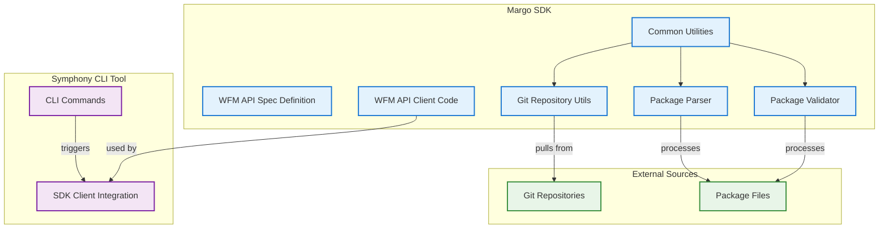
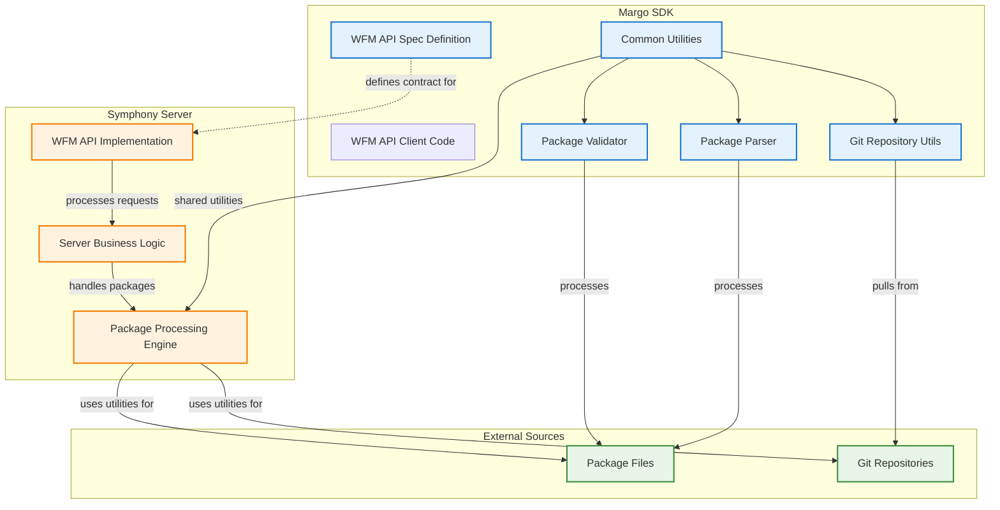

# Workflows

## How this project maps to the Margo spec

- **Workload Supplier/Application:** Provides application packages to the WFM.
- **Fleet Manager Supplier/Workload Fleet Manager:** Orchestrates and provisions workloads on devices.
- **Device Supplier/Device:** End devices where workloads are deployed.

## Typical Usage

1. **Onboard an Application Package**
   - Use the API client to submit a new app package (from Git or other sources).
2. **List Application Packages**
   - Query the WFM for available packages.
3. **Delete Application Package**
   - Remove a package from the WFM.
4. **Authentication**
   - Use provided plugins for basic, no-auth, or custom authentication.

## Extending Workflows
- NOTE: Not considered for now 
- Add new package sources by implementing the `PackageSource` interface.
- Support new authentication flows as needed.

---
# Symphony CLI and Margo SDK integration workflow

# Symphony Server and Margo SDK integration workflow

