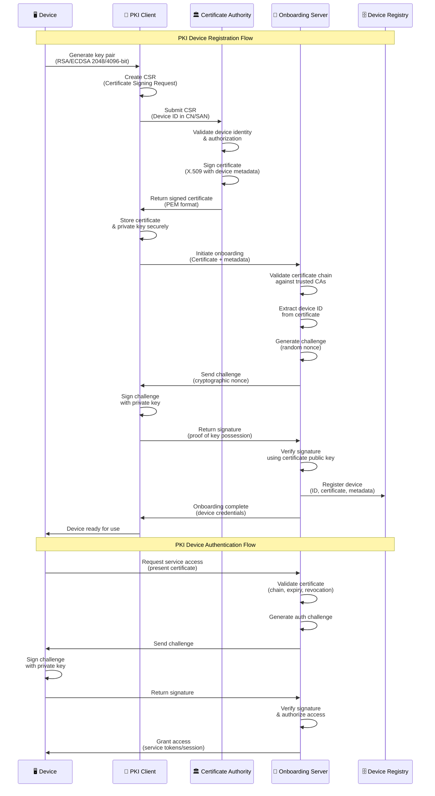
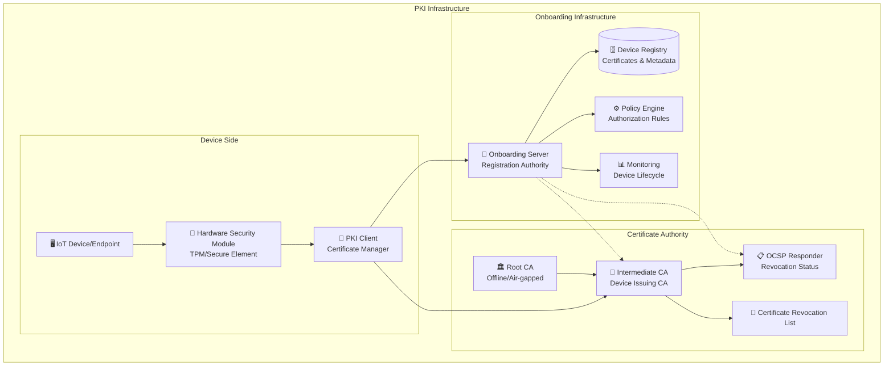
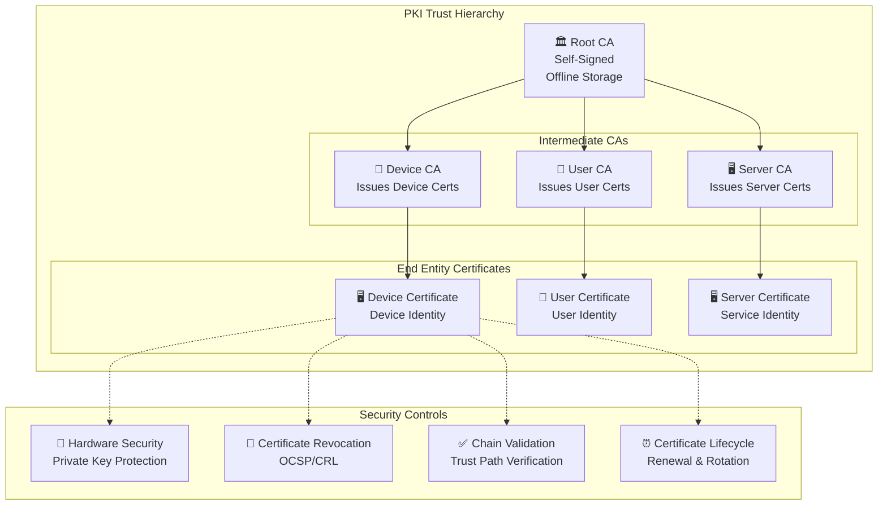
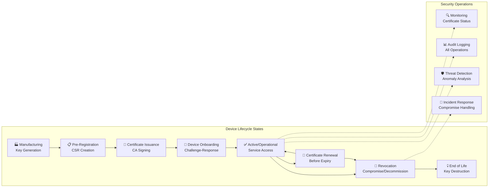
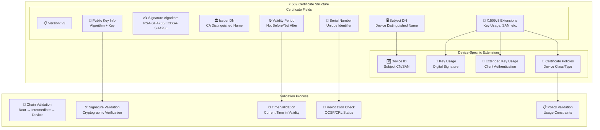

TBD: Add more documentation here.

```mermaid
sequenceDiagram
    participant Device as 🖥️ Device
    participant Client as 📱 PKI Client
    participant CA as 🏛️ Certificate Authority
    participant Server as 🏢 Onboarding Server
    participant DB as 🗄️ Device Registry

    Note over Device, DB: PKI Device Registration Flow
    
    Device->>Client: Generate key pair<br/>(RSA/ECDSA 2048/4096-bit)
    Client->>Client: Create CSR<br/>(Certificate Signing Request)
    Client->>CA: Submit CSR<br/>(Device ID in CN/SAN)
    
    CA->>CA: Validate device identity<br/>& authorization
    CA->>CA: Sign certificate<br/>(X.509 with device metadata)
    CA->>Client: Return signed certificate<br/>(PEM format)
    
    Client->>Client: Store certificate<br/>& private key securely
    Client->>Server: Initiate onboarding<br/>(Certificate + metadata)
    
    Server->>Server: Validate certificate chain<br/>against trusted CAs
    Server->>Server: Extract device ID<br/>from certificate
    Server->>Server: Generate challenge<br/>(random nonce)
    
    Server->>Client: Send challenge<br/>(cryptographic nonce)
    Client->>Client: Sign challenge<br/>with private key
    Client->>Server: Return signature<br/>(proof of key possession)
    
    Server->>Server: Verify signature<br/>using certificate public key
    Server->>DB: Register device<br/>(ID, certificate, metadata)
    Server->>Client: Onboarding complete<br/>(device credentials)
    Client->>Device: Device ready for use

    Note over Device, DB: PKI Device Authentication Flow
    
    Device->>Server: Request service access<br/>(present certificate)
    Server->>Server: Validate certificate<br/>(chain, expiry, revocation)
    Server->>Server: Generate auth challenge
    Server->>Device: Send challenge
    
    Device->>Device: Sign challenge<br/>with private key
    Device->>Server: Return signature
    Server->>Server: Verify signature<br/>& authorize access
    Server->>Device: Grant access<br/>(service tokens/session)
```

---

```mermaid
graph TB
    subgraph "PKI Infrastructure"
        subgraph "Device Side"
            Device[🖥️ IoT Device/Endpoint]
            HSM[🔐 Hardware Security Module<br/>TPM/Secure Element]
            Client[📱 PKI Client<br/>Certificate Manager]
        end
        
        subgraph "Certificate Authority"
            RootCA[🏛️ Root CA<br/>Offline/Air-gapped]
            IntermediateCA[🏢 Intermediate CA<br/>Device Issuing CA]
            OCSP[📋 OCSP Responder<br/>Revocation Status]
            CRL[📜 Certificate Revocation List]
        end
        
        subgraph "Onboarding Infrastructure"
            OnboardServer[🏢 Onboarding Server<br/>Registration Authority]
            DeviceDB[(🗄️ Device Registry<br/>Certificates & Metadata)]
            PolicyEngine[⚙️ Policy Engine<br/>Authorization Rules]
            Monitor[📊 Monitoring<br/>Device Lifecycle]
        end
    end
    
    Device --> HSM
    HSM --> Client
    Client --> IntermediateCA
    Client --> OnboardServer
    
    RootCA --> IntermediateCA
    IntermediateCA --> OCSP
    IntermediateCA --> CRL
    
    OnboardServer --> DeviceDB
    OnboardServer --> PolicyEngine
    OnboardServer --> Monitor
    
    OnboardServer -.-> IntermediateCA
    OnboardServer -.-> OCSP
```

---

```mermaid
graph TD
    subgraph "PKI Trust Hierarchy"
        RootCA[🏛️ Root CA<br/>Self-Signed<br/>Offline Storage]
        
        subgraph "Intermediate CAs"
            DeviceCA[🏢 Device CA<br/>Issues Device Certs]
            UserCA[👤 User CA<br/>Issues User Certs]
            ServerCA[🖥️ Server CA<br/>Issues Server Certs]
        end
        
        subgraph "End Entity Certificates"
            DeviceCert[🖥️ Device Certificate<br/>Device Identity]
            UserCert[👤 User Certificate<br/>User Identity]
            ServerCert[🖥️ Server Certificate<br/>Service Identity]
        end
    end
    
    RootCA --> DeviceCA
    RootCA --> UserCA
    RootCA --> ServerCA
    
    DeviceCA --> DeviceCert
    UserCA --> UserCert
    ServerCA --> ServerCert
    
    subgraph "Security Controls"
        HSM1[🔐 Hardware Security<br/>Private Key Protection]
        Revocation[🚫 Certificate Revocation<br/>OCSP/CRL]
        Validation[✅ Chain Validation<br/>Trust Path Verification]
        Expiry[⏰ Certificate Lifecycle<br/>Renewal & Rotation]
    end
    
    DeviceCert -.-> HSM1
    DeviceCert -.-> Revocation
    DeviceCert -.-> Validation
    DeviceCert -.-> Expiry
```

---

```mermaid
graph LR
    subgraph "Device Lifecycle States"
        A[🏭 Manufacturing<br/>Key Generation]
        B[📋 Pre-Registration<br/>CSR Creation]
        C[🔐 Certificate Issuance<br/>CA Signing]
        D[📱 Device Onboarding<br/>Challenge-Response]
        E[✅ Active/Operational<br/>Service Access]
        F[🔄 Certificate Renewal<br/>Before Expiry]
        G[🚫 Revocation<br/>Compromise/Decommission]
        H[💀 End of Life<br/>Key Destruction]
    end
    
    A --> B
    B --> C
    C --> D
    D --> E
    E --> F
    F --> E
    E --> G
    G --> H
    F --> G
    
    subgraph "Security Operations"
        I[🔍 Monitoring<br/>Certificate Status]
        J[📊 Audit Logging<br/>All Operations]
        K[🛡️ Threat Detection<br/>Anomaly Analysis]
        L[🔧 Incident Response<br/>Compromise Handling]
    end
    
    E -.-> I
    E -.-> J
    E -.-> K
    G -.-> L
```

---

```mermaid
graph TB
    subgraph "X.509 Certificate Structure"
        subgraph "Certificate Fields"
            Version[📋 Version: v3]
            Serial[🔢 Serial Number<br/>Unique Identifier]
            Signature[✍️ Signature Algorithm<br/>RSA-SHA256/ECDSA-SHA256]
            Issuer[🏛️ Issuer DN<br/>CA Distinguished Name]
            Validity[⏰ Validity Period<br/>Not Before/Not After]
            Subject[🖥️ Subject DN<br/>Device Distinguished Name]
            PublicKey[🔑 Public Key Info<br/>Algorithm + Key]
            Extensions[📎 X.509v3 Extensions<br/>Key Usage, SAN, etc.]
        end
        
        subgraph "Device-Specific Extensions"
            DeviceID[🆔 Device ID<br/>Subject CN/SAN]
            KeyUsage[🔐 Key Usage<br/>Digital Signature]
            ExtKeyUsage[🎯 Extended Key Usage<br/>Client Authentication]
            Policies[📜 Certificate Policies<br/>Device Class/Type]
        end
    end
    
    Subject --> DeviceID
    Extensions --> KeyUsage
    Extensions --> ExtKeyUsage
    Extensions --> Policies
    
    subgraph "Validation Process"
        ChainVal[🔗 Chain Validation<br/>Root → Intermediate → Device]
        SigVal[✅ Signature Validation<br/>Cryptographic Verification]
        TimeVal[⏰ Time Validation<br/>Current Time in Validity]
        RevVal[🚫 Revocation Check<br/>OCSP/CRL Status]
        PolicyVal[📋 Policy Validation<br/>Usage Constraints]
    end
    
    PublicKey --> SigVal
    Validity --> TimeVal
    Serial --> RevVal
    Policies --> PolicyVal
```